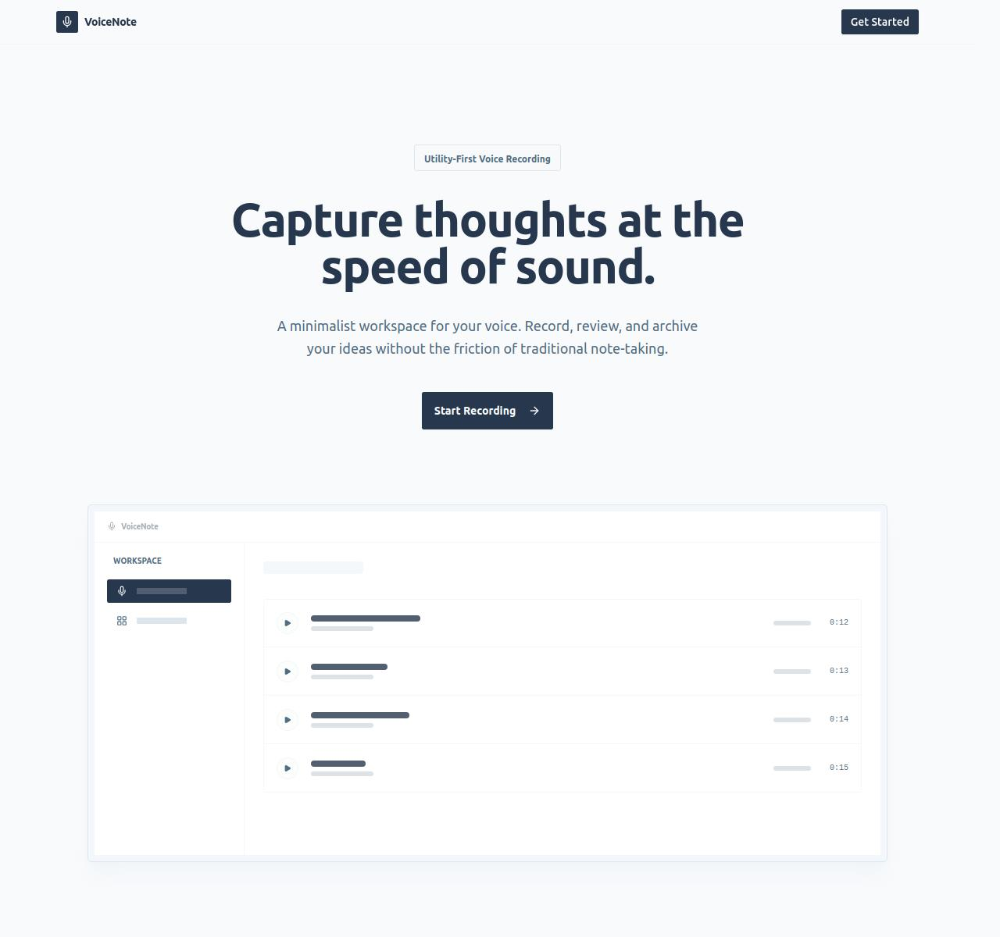

# VoiceNote

A modern web application for recording, storing, and managing voice notes in the cloud. Built with a focus on speed, security, and a seamless user experience.



[](https://kit.svelte.dev/)
[](https://workers.cloudflare.com/)
[](https://tailwindcss.com/)
[](LICENSE)

## ✨ Features

### 🎙️ Current Capabilities
- **Instant Recording** - High-quality voice recording directly in the browser.
- **Visual Waveforms** - Interactive audio visualization using Wavesurfer.js.
- **Cloud Storage** - Securely store recordings using Cloudflare R2.

- **Authentication** - Secure login powered by Better-Auth (Google OAuth).

### 🛠️ Planned Features
- **Audio Editor** - Trim recordings and remove silence automatically.
- **Secure Sharing** - Generate time-limited expiration links for your notes.
- **Trash & Recovery** - A safety net for accidentally deleted recordings.
- **Auto Transcription** - Convert voice to text using AI.
- **Smart Organization** - Organize your recordings into groups 
- **Dark Mode** - Built-in theme support for comfortable late-night usage.

## 🛠️ Tech Stack

- **Framework**: [SvelteKit 5](https://kit.svelte.dev/) (Runes, SSR, Form Actions)
- **Styling**: [Tailwind CSS 4](https://tailwindcss.com/), [shadcn-svelte](https://next.shadcn-svelte.com/)
- **Database**: [Cloudflare D1](https://developers.cloudflare.com/d1/) (SQLite)
- **ORM**: [Drizzle ORM](https://orm.drizzle.team/)
- **Storage**: [Cloudflare R2](https://developers.cloudflare.com/r2/)
- **Auth**: [Better-Auth](https://www.better-auth.com/)
- **Audio**: [Wavesurfer.js](https://wavesurfer-js.org/)
- **Deployment**: [Cloudflare Workers](https://workers.cloudflare.com/)

## 🚀 Getting Started

### Prerequisites
- [Node.js](https://nodejs.org/) (v20 or later)
- [pnpm](https://pnpm.io/) (Recommended package manager)
- [Wrangler CLI](https://developers.cloudflare.com/workers/wrangler/install-setup/) (For Cloudflare services)

### Development Setup

1. **Clone the repository**
   ```bash
   git clone https://github.com/your-username/voice-note.git
   cd voice-note
   ```

2. **Install dependencies**
   ```bash
   pnpm install
   ```

3. **Environment Configuration**
   Copy the example environment file and fill in your credentials (Google OAuth, etc.):
   ```bash
   cp .env.example .env
   ```

4. **Initialize Local Database**
   ```bash
   pnpm db:migrate:local
   ```

5. **Run Development Server**
   ```bash
   pnpm dev
   ```

### Database Management

```bash
# Generate new migrations after schema changes
pnpm db:generate

# Apply migrations to local D1 instance
pnpm db:migrate:local

# Open Drizzle Studio to view local data
pnpm db:studio
```

## 📁 Project Structure

```text
voice-note/
├── drizzle/              # Database migrations
├── src/
│   ├── lib/
│   │   ├── assets/       # Static assets & images
│   │   ├── components/   # UI components (shadcn-svelte)
│   │   ├── server/       # Server-only logic (Auth, DB, Services)
│   │   └── utils/        # Helper functions
│   └── routes/           # SvelteKit pages and API endpoints
├── static/               # Public static files
├── wrangler.jsonc        # Cloudflare configuration
└── drizzle.config.ts     # Drizzle ORM configuration
```

## 📄 License

This project is licensed under the MIT License - see the [LICENSE](LICENSE) file for details.
